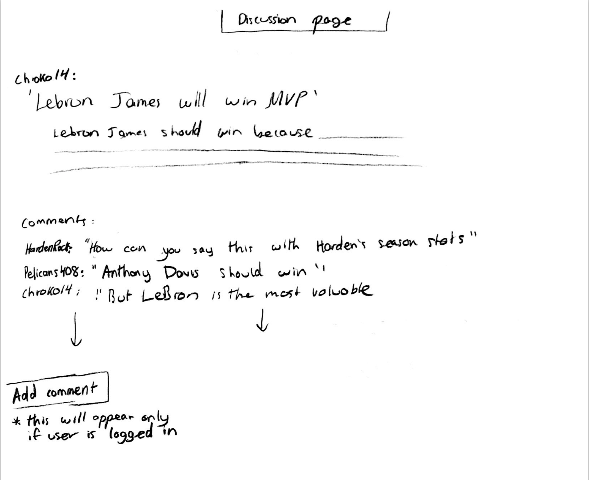

# The Basksetball Barbershop
https://basketball-barbershop.herokuapp.com/

## Overview

The basketball barbershop is a friendly forum in which basketball fans can talk hoops in any way they see fit. Focusing on the latest NBA news and trends, it is a place for people to not only keep up to date on whats happening in the league, but to share their opinions and predictions about what is happening and will happen in the future. Is Lebron the greatest of all time? Will Golden State win another championship? Should James Harden win MVP? The basketball barbershop is the perfect place to engage in open debate on these and countless other hot basetball topics. 

The Basketball Barbershop is a web app that will allow users to create an account and post the latest news or opinions, as well as comment on other peoples posts and engage in debate. Users can register and login. Once they're logged in, they may browse through the main feed of posts, and comment on whichever posts they prefer. Additionally, logged in users will have the option of creating a new discussion. 


## Data Model

The application will store users, posts, and comments.

* users can have as many posts as they like
* each post can have many comments


An Example User:

```javascript
{
  username: "shannonshopper",
  hash: // a password hash,
  posts: // a list of the user's posts,
  comments: // a list of the user's comments,
}
```

An Example Post:

```javascript
{
  user: // a reference to the User object of who made the post,
  Title: "Lebron James should win MVP",
  Status: "Lebron should win MVP becuase...",
  comments: [ // a list of user comments on this post],
  createdAt: // timestamp
}
```

An example Comment Object:

```javascript
{
  user: // a reference to the User object of the person who made the comment,
  post: // a reference to the original post the comment was made on,
  comment: "No way Lebron should win MVP, its Harden's for sure", 
  createdAt: //timestamp
}
```


## [Link to Commented First Draft Schema](db.js) 


## Wireframes

/ - homepage, user is logged in 


/ - homepage, user is not logged in 


/post - page to create new post 


/user/discussion - page for showing specific post, plust its comments



/register - page for registering an account


## Site map


## User Stories or Use Cases

1. as non-registered user, I can register a new account with the site
2. as a user, I can log in to the site
3. as a user, I can view all posts in a main feed
4. as a user, I can create a new post
5. as a user, I can comment on existing posts
6. as a user, I can filter posts by popularity (tbd on how to determine post popularity)

## Research Topics

* (5 points) Selenium
    * Selenium is a platform which automates web browsers
    * I will use it in order to test my website's functionality 
    * For example, I could use selenium in order to test the register and post portions of my website 
* (3 points) Perform client side form validation using a JavaScript library
    * I will use the Parsely form validation library for Javascript in order to validate forms 
    * For example, this can be used to ensure the user enters a valid email upon registation

8 points total out of 8 required points 


## [Link to Initial Main Project File](app.js) 
